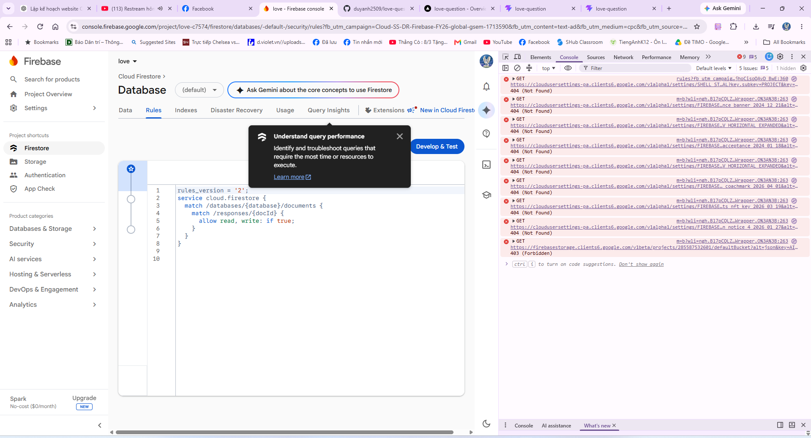

# Love Question - Website tương tác với Real-time Sync ❤️

Website React + Vite với tính năng đồng bộ thời gian thực giữa admin và người dùng, không cần backend server!

## ✨ Tính năng chính

- 🎯 Câu hỏi tương tác với animation vui nhộn
- 📝 Form chọn hoạt động Chủ Nhật
- 💬 Nhập lời nhắn tùy chọn
- ⚡ **Real-time sync**: Admin thấy responses ngay lập tức khi người dùng gửi
- 🔐 Admin page bảo mật bằng passcode
- 🔥 Firebase Firestore cho real-time database
- 📱 Responsive design
- 🌐 Deploy dễ dàng lên Vercel

## 🚀 Real-time Sync

Dự án này sử dụng **Firebase Firestore onSnapshot** để đồng bộ dữ liệu thời gian thực:

```
User gửi response → Firestore → Admin nhận update ngay lập tức! ⚡
```

- ✅ Không cần backend server
- ✅ Không cần WebSocket riêng
- ✅ Tự động scale theo traffic
- ✅ Hoàn toàn miễn phí (Firebase Spark plan)

Xem chi tiết: [REALTIME_SYNC.md](./REALTIME_SYNC.md)

## 📦 Tech Stack

- **React 19** - UI framework
- **Vite 8** - Build tool
- **React Router 7** - Routing
- **Firebase 12** - Real-time database
- **Vercel** - Hosting

## 🛠️ Development

### Prerequisites

- Node.js 18+
- npm hoặc yarn

### Installation

```bash
# Clone repo
git clone https://github.com/duyanh2509/love-question.git
cd love-question

# Install dependencies
npm install

# Start dev server
npm run dev
```

**Lưu ý:** Firebase config đã được cấu hình sẵn trong code.

### Available Scripts

```bash
npm run dev      # Start dev server
npm run build    # Build for production
npm run preview  # Preview production build
npm run lint     # Run ESLint
```

## 🌐 Deploy lên Vercel

### Quick Deploy

1. Push code lên GitHub
2. Import vào Vercel
3. Deploy! 🎉

**Không cần** cấu hình Environment Variables - Firebase đã được cấu hình sẵn trong code.

```bash
git add .
git commit -m "Deploy to Vercel"
git push
```

## 📁 Project Structure

```
src/
├── components/     # Reusable components
│   ├── ActivityOption.jsx
│   ├── Loading.jsx
│   └── YesNoButtons.jsx
├── pages/          # Page components
│   ├── Home.jsx
│   ├── SundayPlan.jsx
│   ├── Success.jsx
│   ├── Admin.jsx
│   └── IdentityGate.jsx
├── services/       # Business logic
│   └── responseService.js  # Firebase + real-time sync
├── firebase/       # Firebase config
│   └── config.js
├── App.jsx         # Router setup
└── main.jsx        # Entry point
```

## 🔒 Firebase Security

Firestore Rules được cấu hình để:
- ✅ Cho phép tất cả đọc (admin xem responses)
- ✅ Cho phép tạo mới (user gửi response)
- ❌ Không cho phép cập nhật/xóa

```javascript
rules_version = '2';
service cloud.firestore {
  match /databases/{database}/documents {
    match /responses/{document} {
      allow read: if true;
      allow create: if true;
      allow update, delete: if false;
    }
  }
}
```

## 📚 Documentation

- [FIREBASE_SETUP.md](./FIREBASE_SETUP.md) - Hướng dẫn setup Firebase
- [REALTIME_SYNC.md](./REALTIME_SYNC.md) - Chi tiết về real-time sync
- [DEPLOY_VERCEL.md](./DEPLOY_VERCEL.md) - Hướng dẫn deploy
- [ke-hoach-website-react-het-gian.md](./ke-hoach-website-react-het-gian.md) - Kế hoạch dự án

## 🎨 Customization

### Đổi mật khẩu admin

Mặc định: `yeuem`

Để đổi, sửa trong file `src/pages/Admin.jsx`:
```javascript
const ADMIN_PASSCODE = 'password-moi-cua-ban'
```

### Đổi số lượng responses hiển thị

Sửa trong `src/services/responseService.js`:
```javascript
limit(50) // Đổi 50 thành số khác
```

## 🐛 Troubleshooting

### Real-time sync không hoạt động

1. Kiểm tra Firestore Rules trong Firebase Console
2. Mở Console (F12) để xem lỗi
3. Đảm bảo đã tạo Firestore database

### Admin page không hiện responses

1. Kiểm tra mật khẩu admin (mặc định: `yeuem`)
2. Kiểm tra Firebase connection trong Console log
3. Xem Firebase Console > Firestore > Data

## 📄 License

MIT

## 🤝 Contributing

Pull requests are welcome! For major changes, please open an issue first.

---

Made with ❤️ using React + Firebase + Vercel
